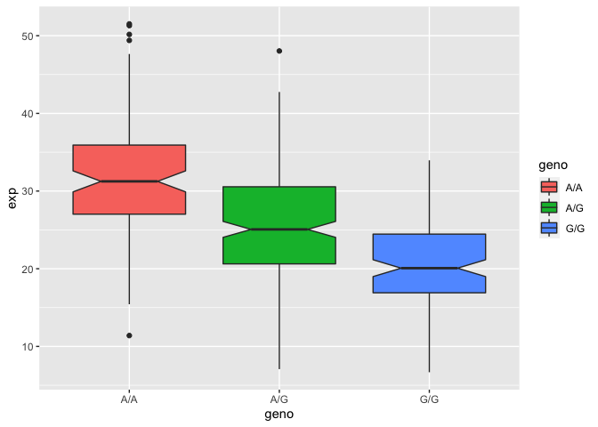

Genomics lab 11.PopScaleAnalysis
================
Lidia Gallegos

## Population Scale Analysis

How many samples do we have?

``` r
expr <- read.table("rs8067378_ENSG00000172057.6.txt")
head(expr)
```

       sample geno      exp
    1 HG00367  A/G 28.96038
    2 NA20768  A/G 20.24449
    3 HG00361  A/A 31.32628
    4 HG00135  A/A 34.11169
    5 NA18870  G/G 18.25141
    6 NA11993  A/A 32.89721

``` r
nrow(expr)
```

    [1] 462

``` r
table(expr$geno)
```


    A/A A/G G/G 
    108 233 121 

``` r
library(ggplot2)
```

BOXPLOT

``` r
ggplot(expr) + aes(geno, exp, fill=geno) + geom_boxplot(notch = TRUE)
```



> Q13: Read this file into R and determine the sample size for each
> genotype and their corresponding median expression levels for each of
> these genotypes.

> Q14: Generate a boxplot with a box per genotype, what could you infer
> from the relative expression value between A/A and G/G displayed in
> this plot? Does the SNP effect the expression of ORMDL3?

From the relative expression value between A\|A and G\|G, we can infer
that they are statistically significant and very different since the
boxplot shows no (major) overlap between the notches. Thus, the SNP
affects expression of ORMDL3.
